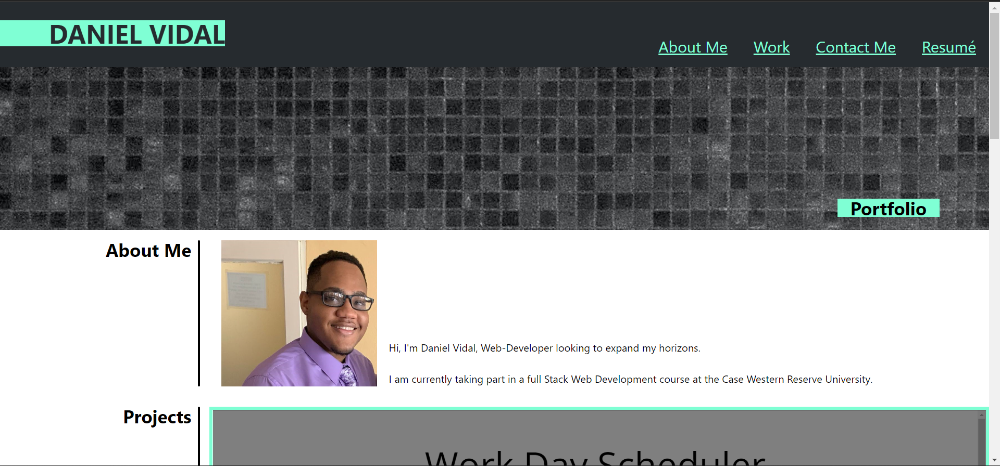
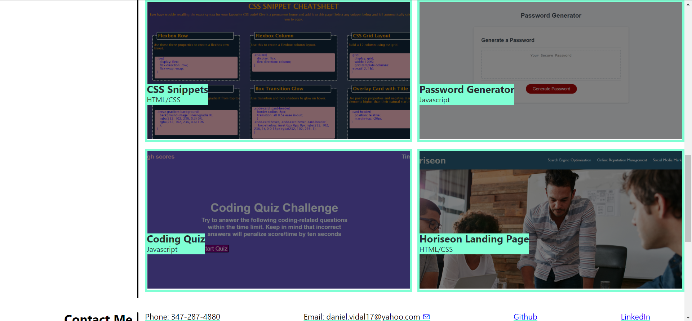
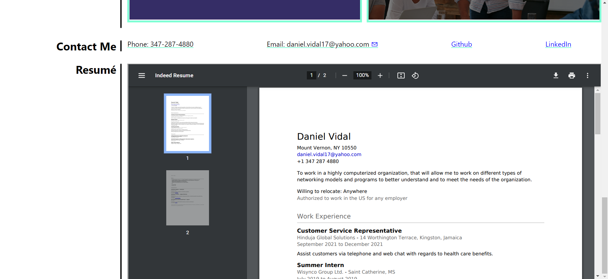

# My-Portfolio

## Description

This Portfolio is a webpage to show and keep track of my progress as a developer. With his website I will be showing the programs I make throughout my journey as a developer.

## Screenshots

## Tests

You can go ahead and check wheether the navigation bar works by simply clicking on the headings at the top of the page.

You can also click on the images in the Work section to take you to different deployed applications (Currently only the Landing Page has been build, the rest are placeholders that open the portfolio in new tabs)

## License

Copyright (c) [2022] [Daniel R. Vidal]

